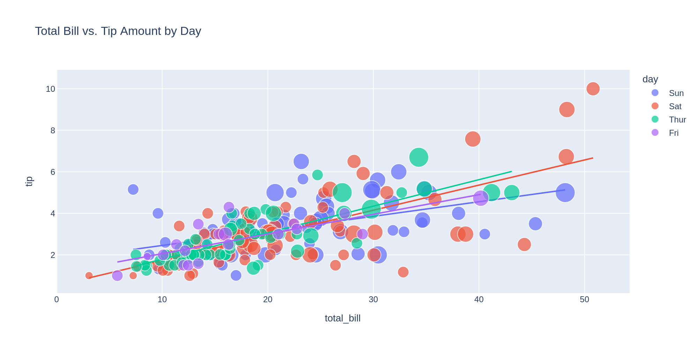
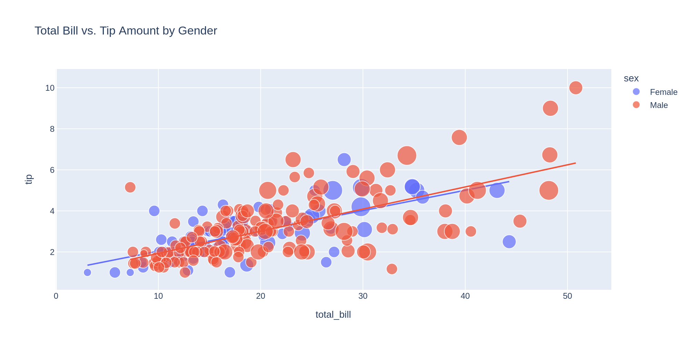
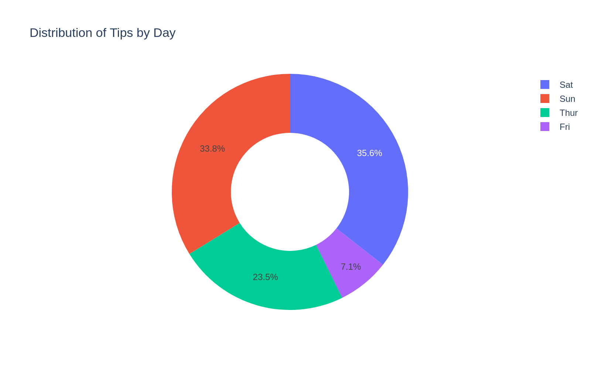
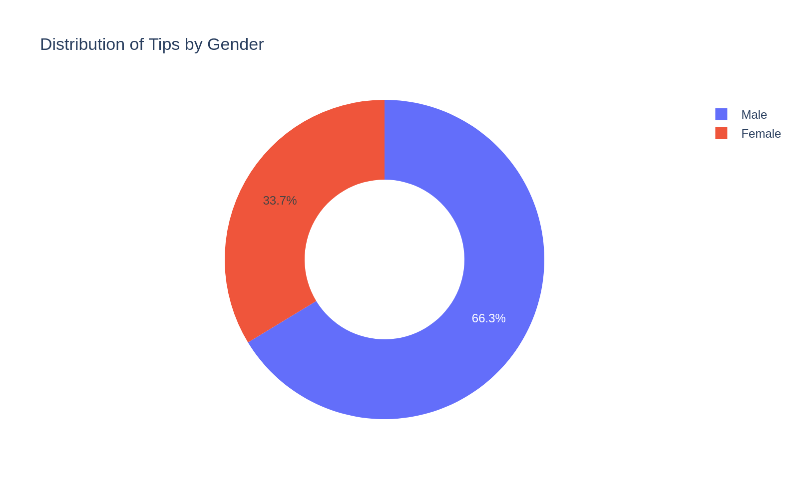
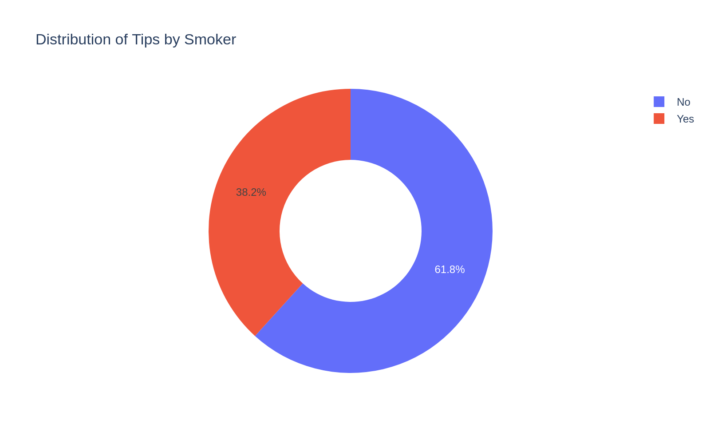
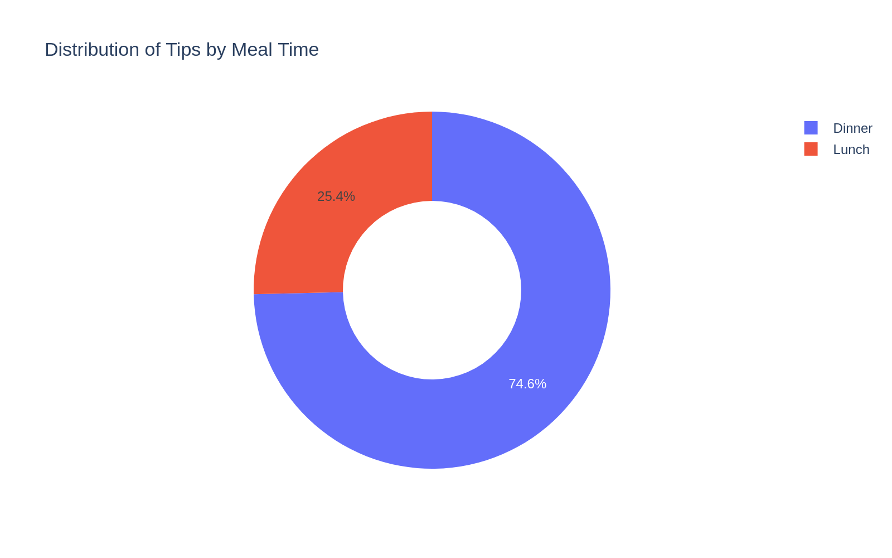

# Waiter Tips Analysis

A data analysis project exploring the factors that influence tipping behavior in a restaurant, using the classic `tips.csv` dataset. The analysis uses interactive Plotly visualizations to examine how total bill, gender, day of the week, smoking status, and meal time relate to tip amounts.

## Dataset

The dataset (`tips.csv`) contains 244 records with the following columns:

| Column | Description |
|---|---|
| `total_bill` | Total bill amount |
| `tip` | Tip amount given |
| `sex` | Gender of the customer |
| `smoker` | Whether the customer smokes |
| `day` | Day of the week |
| `time` | Meal time (Lunch/Dinner) |
| `size` | Size of the party |

Source: [amankharwal/Website-data](https://raw.githubusercontent.com/amankharwal/Website-data/master/tips.csv)

## Analysis Performed

### 1. Total Bill vs. Tip Amount by Day
Scatter plot with OLS trendlines and party size as bubble size.

**Conclusion:** The graph shows a positive relationship between total bill and tip amount. As the total bill increases, the tip generally tends to increase as well. The trendlines for different days indicate a similar upward pattern, although there is some variation in tip amounts. Larger bubbles represent larger party sizes, suggesting that bigger groups often have higher total bills.

### 2. Total Bill vs. Tip Amount by Gender
Scatter plot with OLS trendlines and party size as bubble size.

**Conclusion:** The graph shows a positive relationship between total bill and tip amount for both male and female customers. As the total bill increases, the tip generally increases as well. Male customers have more observations and appear more frequently at higher bill amounts.

### 3. Distribution of Tips by Day
Pie chart of tip share across days.

**Conclusion:** Saturday accounts for the highest share of total tips (35.6%), followed by Sunday (33.8%). Thursday contributes 23.5%, while Friday has the lowest share at 7.1%.

### 4. Distribution of Tips by Gender
Pie chart of tip share by gender.

**Conclusion:** Male customers have the highest share of total tips (66.3%), while female customers have the lowest share at 33.7%.

### 5. Distribution of Tips by Smoker
Pie chart of tip share by smoking status.

**Conclusion:** Customers who smoke account for the highest share of total tips (61.8%), while non-smokers account for the lowest share at 38.2%.

### 6. Distribution of Tips by Meal Time
Pie chart of tip share by lunch vs. dinner.

**Conclusion:** Dinner accounts for 74.6% of total tips, while lunch accounts for 25.4%.

## Final Conclusions

- **Bill amount and tips are positively correlated.** Across all days and both genders, tips generally increase as the total bill increases, indicating that customers tend to tip proportionally to how much they spend.
- **Party size matters.** Larger parties tend to generate larger total bills, which in turn corresponds to higher tip amounts.
- **Male customers contribute the most tips overall**, accounting for **66.3%** of total tips versus **33.7%** from female customers — driven largely by a higher volume of male customers in the dataset, especially at higher bill amounts.
- **Saturday and Sunday are the biggest tipping days**, contributing **35.6%** and **33.8%** of total tips respectively. Thursday follows at **23.5%**, while Friday contributes the least at just **7.1%**.
- **Smokers tip more (in aggregate) than non-smokers**, making up **61.8%** of total tips compared to **38.2%** from non-smokers.
- **Dinner is by far the bigger tipping period**, accounting for **74.6%** of total tips, compared to **25.4%** during lunch.

### Overall Takeaway
Tipping behavior at this restaurant is most strongly driven by **bill size** (and by extension, party size), with tips scaling roughly proportionally to spending. On top of this base relationship, **when** customers dine (weekends and dinner service) has the biggest impact on total tip volume, making Saturday/Sunday dinner shifts the most lucrative for waitstaff. Demographic factors like gender and smoking status show notable differences in tip share, but these are likely influenced by the imbalance in how frequently each group appears in the dataset rather than a per-customer tipping preference.

## Tools Used

- **pandas** — data loading and manipulation
- **Plotly Express** — interactive scatter and pie chart visualizations

## How to Run

1. Install dependencies: `pip install pandas plotly`
2. Open and run `Waiter_Tips_Analysis.ipynb` in Jupyter Notebook/Lab.
3. 
